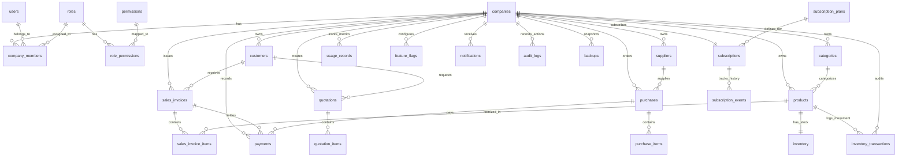

# InvoicePro Entity Relationship Diagram (ERD)

```mermaid
erDiagram
    companies ||--o{ company_members : "has"
    users ||--o{ company_members : "belongs_to"
    roles ||--o{ company_members : "assigned_to"
    roles ||--o{ role_permissions : "has"
    permissions ||--o{ role_permissions : "mapped_to"

    companies ||--o{ customers : "owns"
    companies ||--o{ suppliers : "owns"
    companies ||--o{ categories : "owns"
    companies ||--o{ products : "owns"
    categories ||--o{ products : "categorizes"

    products ||--|| inventory : "has_stock"
    products ||--o{ inventory_transactions : "logs_movement"
    companies ||--o{ inventory_transactions : "audits"

    companies ||--o{ sales_invoices : "issues"
    customers ||--o{ sales_invoices : "receives"
    sales_invoices ||--o{ sales_invoice_items : "contains"
    products ||--o{ sales_invoice_items : "itemized_in"

    companies ||--o{ quotations : "creates"
    customers ||--o{ quotations : "requests"
    quotations ||--o{ quotation_items : "contains"

    companies ||--o{ purchases : "orders"
    suppliers ||--o{ purchases : "supplies"
    purchases ||--o{ purchase_items : "contains"

    companies ||--o{ payments : "records"
    sales_invoices ||--o{ payments : "settles"
    purchases ||--o{ payments : "pays"

    companies ||--|| subscriptions : "subscribes"
    subscription_plans ||--o{ subscriptions : "defines_tier"
    subscriptions ||--o{ subscription_events : "tracks_history"
    companies ||--o{ usage_records : "tracks_metrics"
    companies ||--o{ feature_flags : "configures"

    companies ||--o{ notifications : "receives"
    companies ||--o{ audit_logs : "records_actions"
    companies ||--o{ backups : "snapshots"
```
